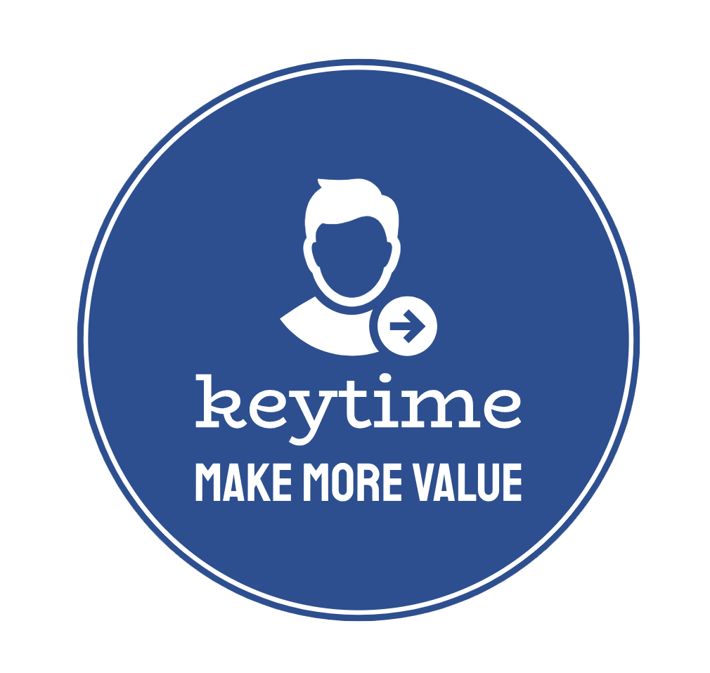

<a name="readme-top"></a>
<!-- PROJECT SHIELDS -->
[![Contributors][contributors-shield]][contributors-url]
[![Forks][forks-shield]][forks-url]
[![Stargazers][stars-shield]][stars-url]
[![Issues][issues-shield]][issues-url]
[![MIT License][license-shield]][license-url]
[![LinkedIn][linkedin-shield]][linkedin-url]


<!-- PROJECT LOGO -->
<br />
<div align="center">
  <a href="https://github.com/hoangduy0610/it008-keytime">
    
  </a>

  <h3 align="center">KeyTime - Equipment Management</h3>

  <p align="center">
    An awesome tool for managing equipment!
    <br />
    <a href="https://github.com/hoangduy0610/it008-keytime"><strong>Explore the docs »</strong></a>
    <br />
    <br />
    <a href="https://github.com/hoangduy0610/it008-keytime">View Demo</a>
    ·
    <a href="https://github.com/hoangduy0610/it008-keytime/issues">Report Bug</a>
    ·
    <a href="https://github.com/hoangduy0610/it008-keytime/issues">Request Feature</a>
  </p>
</div>


<!-- TABLE OF CONTENTS -->
<details>
  <summary>Table of Contents</summary>
  <ol>
    <li>
      <a href="#our-team">Our Team</a>
    </li>
    <li>
      <a href="#about-the-project">About The Project</a>
    </li>
    <li>
      <a href="#getting-started">Getting Started</a>
      <ul>
        <li><a href="#prerequisites">Prerequisites</a></li>
        <li><a href="#installation">Installation</a></li>
      </ul>
    </li>
    <li><a href="#roadmap">Roadmap</a></li>
    <li><a href="#contributing">Contributing</a></li>
    <li><a href="#license">License</a></li>
    <li><a href="#contact">Contact</a></li>
    <li><a href="#acknowledgments">Acknowledgments</a></li>
  </ol>
</details>

## Our Team
- Leader: Nguyen Hoang Duy - 22520328 - [Github](https://github.com/hoangduy0610)
- Architect Consultant: Nguyen Ngoc Minh Quoc - 22521214 - [Github](https://github.com/gundamdouble00)
- Member: Hoang Ho Quoc Bao - 22520102
- Member: Tran Duc Chinh - 22520158
- **Supervisor: Nguyen Tan Toan**

<!-- ABOUT THE PROJECT -->
## About The Project

[![Product Name Screen Shot][product-screenshot]](https://github.com/hoangduy0610/it008-keytime)

KeyTime is an equipment management software designed to help companies track, organize and manage their equipment inventory efficiently.

**Features**

- Equipment tracking - Add equipment details like name, ID, category, specs, etc. Easily search and filter equipment.
- Rental manage - Allow user to request rental equipments. The property manager can Approve/Decline and review requests.
- Inventory reporting - Get reports on equipment inventory status, utilization, maintenance metrics, etc.
- Access controls - Manage user roles and permissions. Restrict access as needed.

<p align="right">(<a href="#readme-top">back to top</a>)</p>


<!-- GETTING STARTED -->
## Getting Started

You can run directly by download Installer folder [Download](https://drive.google.com/drive/u/0/folders/1MANHbuTq0yITHgIInUptsoruKx4zLDJw) and then install by running `setup.exe`
If you want to run local database:
1. Create new database (can use pgsql command prompt or PgAdmin/DBeaver)
2. Restore `db.sql` to the database created in step 2.
3. Edit DB config in `config.ini`

Or to get a local copy up, please running follow these simple example steps below.
Video instructions: [Youtube](https://youtu.be/F4ojfJApslM)

### Prerequisites

You need to install Visual Studio and PostgreSQL first.

* [Visual Studio](https://visualstudio.microsoft.com/)
* [PostgreSQL](https://www.postgresql.org/)

### Installation

1. Clone the repo
   ```sh
   git clone https://github.com/hoangduy0610/it008-keytime.git
   ```
2. Create new database (can use pgsql command prompt or PgAdmin/DBeaver)
3. Restore `db.sql` to the database created in step 2.
4. Edit DB config in `config.ini`
5. Open the IT008-KeyTime.sln file by Visual Studio.
6. Press the "Run" button.

Note: Default admin user is: `admin/admin`

<p align="right">(<a href="#readme-top">back to top</a>)</p>

<!-- ROADMAP -->
## Roadmap

- [x] Rental Report
- [x] Inventory Report
- [x] Import through Excel files
- [ ] Add Changelog
- [ ] Support Barcode Inventory

See the [open issues](https://github.com/hoangduy0610/it008-keytime/issues) for a full list of proposed features (and known issues).

<p align="right">(<a href="#readme-top">back to top</a>)</p>


<!-- CONTRIBUTING -->
## Contributing

Contributions are what make the open source community such an amazing place to learn, inspire, and create. Any contributions you make are **greatly appreciated**.

If you have a suggestion that would make this better, please fork the repo and create a pull request. You can also simply open an issue with the tag "enhancement".
Don't forget to give the project a star! Thanks again!

1. Fork the Project
2. Create your Feature Branch (`git checkout -b feature/AmazingFeature`)
3. Commit your Changes (`git commit -m 'Add some AmazingFeature'`)
4. Push to the Branch (`git push origin feature/AmazingFeature`)
5. Open a Pull Request

<p align="right">(<a href="#readme-top">back to top</a>)</p>


<!-- LICENSE -->
## License

Distributed under the MIT License. See [LICENSE](LICENSE) for more information.

<p align="right">(<a href="#readme-top">back to top</a>)</p>


<!-- CONTACT -->
## Contact

Nguyen Hoang Duy (PO) - [@hoangduy0610](https://github.com/hoangduy0610) - hoangduy06104@gmail.com

Nguyen Ngoc Minh Quoc (Technical Leading) - [@gundamdouble00](https://github.com/gundamdouble00)

Project Link: [https://github.com/hoangduy0610/it008-keytime](https://github.com/hoangduy0610/it008-keytime)

<p align="right">(<a href="#readme-top">back to top</a>)</p>


<!-- ACKNOWLEDGMENTS -->
## Acknowledgments

Use this space to list resources you find helpful and would like to give credit to. I've included a few of my favorites to kick things off!

* [Choose an Open Source License](https://choosealicense.com)
* [GitHub Pages](https://pages.github.com)
* [Font Awesome](https://fontawesome.com)

<p align="right">(<a href="#readme-top">back to top</a>)</p>


<!-- MARKDOWN LINKS & IMAGES -->
<!-- https://www.markdownguide.org/basic-syntax/#reference-style-links -->
[contributors-shield]: https://img.shields.io/github/contributors/hoangduy0610/it008-keytime.svg?style=for-the-badge
[contributors-url]: https://github.com/hoangduy0610/it008-keytime/graphs/contributors
[forks-shield]: https://img.shields.io/github/forks/hoangduy0610/it008-keytime.svg?style=for-the-badge
[forks-url]: https://github.com/hoangduy0610/it008-keytime/network/members
[stars-shield]: https://img.shields.io/github/stars/hoangduy0610/it008-keytime.svg?style=for-the-badge
[stars-url]: https://github.com/hoangduy0610/it008-keytime/stargazers
[issues-shield]: https://img.shields.io/github/issues/hoangduy0610/it008-keytime.svg?style=for-the-badge
[issues-url]: https://github.com/hoangduy0610/it008-keytime/issues
[license-shield]: https://img.shields.io/github/license/hoangduy0610/it008-keytime.svg?style=for-the-badge
[license-url]: https://github.com/hoangduy0610/it008-keytime/blob/master/LICENSE
[linkedin-shield]: https://img.shields.io/badge/-LinkedIn-black.svg?style=for-the-badge&logo=linkedin&colorB=555
[linkedin-url]: https://linkedin.com/in/hoangduy06104
[product-screenshot]: assets/DemoFlows.gif
